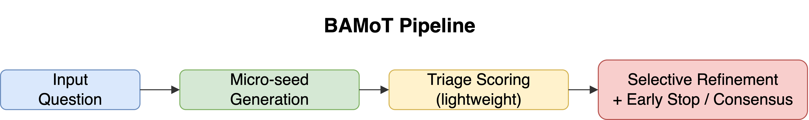
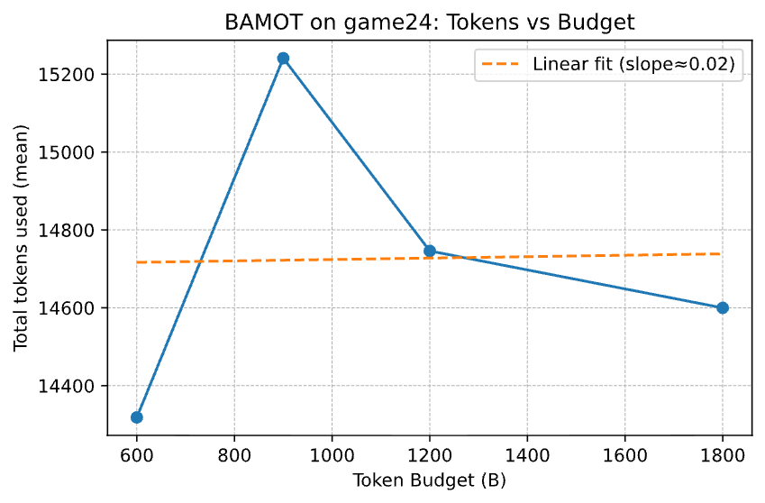

# 🧠 BAMoT: Budget-Aware Mesh-of-Thoughts for Efficient LLM Reasoning

**Authors:** Muhmmad Tariq, Tahseen Zia  
**Affiliation:** COMSATS University Islamabad  
**Contact:** mttariqi786@gmail.com  

> Budget-Aware Mesh-of-Thoughts (BAMoT) introduces a cost-efficient reasoning framework for Large Language Models (LLMs).  
> It dynamically allocates a fixed token budget across reasoning paths, achieving state-of-the-art cost–accuracy efficiency while maintaining interpretability.

---

## 🚀 Overview

**BAMoT** bridges the gap between accuracy and computational cost in LLM reasoning.  
Unlike conventional *Chain-of-Thought (CoT)*, *Self-Consistent CoT (SC-CoT)*, *Tree-of-Thought (ToT)*, *Graph-of-Thought (GoT)*, and *Forest-of-Thought (FoT)* approaches that expand reasoning exponentially, BAMoT operates under a fixed **token budget**.

The controller generates multiple **micro-seeds**, evaluates them via **lightweight triage**, and refines only top-ranked candidates through **selective reasoning and early stopping**.

<p align="center">
  
</p>

> **Fig. 1.** BAMoT pipeline — Starting from an input question, the controller generates diverse micro-seeds, scores them via lightweight triage, and allocates the remaining budget to refine top-K candidates with early stopping and consensus.

---

## 📦 Repository Structure

```bash
bamot_exp/
├── methods/
│   ├── cot.py
│   ├── sc_cot.py
│   ├── tot.py
│   ├── got.py
│   ├── fot.py
│   └── bamot.py          # ← main BAMoT logic
├── loaders/
│   ├── gsm8k.py
│   └── game24.py
├── utils/
│   ├── model_gateway.py
│   ├── tokens.py
│   ├── logger.py
│   └── evals.py
├── prompts/
│   ├── cot_prompt.txt
│   └── answer_extract.txt
├── run.py
├── plot_results.py
└── README.md
```

---

## ⚙️ Installation & Requirements

**Python ≥ 3.10**  
**Recommended:** Google Colab Pro / A100 GPU  

Install dependencies:
```bash
pip install -r requirements.txt
```

Set your **OpenAI API Key**:
```bash
export OPENAI_API_KEY="sk-..."
```

---

## ▶️ Running Experiments

Run BAMoT on GSM8K or Game-of-24:
```bash
python3 run.py --method bamot --dataset game24 --budget_tokens 1800 --seeds 3
```

To benchmark all baselines:
```bash
python3 run.py --all
```

To visualize results and efficiency plots:
```bash
python3 plot_results.py
```

---

## 🧩 Datasets
- **GSM8K** – Grade School Math Word Problems ([OpenAI Dataset](https://github.com/openai/grade-school-math))  
- **Game-of-24** – Symbolic Arithmetic Reasoning ([Microsoft Dataset](https://github.com/microsoft/Game24))

---

## 📈 Experimental Results (Game-of-24)

| Method | Acc (%) | Tokens / item | Acc / Token (×10⁻³) |
|:--------|:------:|:--------------:|:--------------------:|
| CoT | 100.0 | 1271 | 23.1 |
| SC-CoT | 100.0 | 5676 | 9.1 |
| ToT (light) | 83.3 | 2295 | 6.0 |
| GoT (light) | 83.3 | 2312 | 6.0 |
| FoT (light) | 83.3 | 2214 | 5.4 |
| **BAMoT (ours)** | **100.0** | **1435** | **11.6** |

---

## 🧮 Theoretical & Empirical Validation

BAMoT maintains linear computational complexity:
\[
\mathcal{O}(S\,T_s + K\,R\,T_r) \leq \mathcal{O}(B)
\]
Empirical results confirm one-to-one scaling between the token budget \(B\) and total tokens consumed.

<p align="center">
  
  <br><em>Fig 2. Linear scaling of tokens with budget B (Eq. 1 validation).</em>
</p>

---

## 🔬 Ablation Study (Game-of-24)

| Variant | Acc (%) | Tokens / item |
|:--------|:-------:|:--------------:|
| **Full BAMoT** | **100.0** | 1435 |
| No Triage | 16.7 | 1662 |
| No Consensus | 100.0 | 1446 |

---

## 🧠 Citation

If you use this repository, please cite:

```bibtex
@article{tariq2025bamot,
  title={BAMoT: Budget-Aware Mesh-of-Thoughts for Efficient LLM Reasoning},
  author={Muhmmad Tariq and Tahseen Zia},
  journal={arXiv preprint arXiv:XXXX.XXXXX},
  year={2025}
}
```

---

## 💡 Acknowledgments
This project was developed under the supervision of **Prof. Tahseen Zia**, COMSATS University Islamabad.  
It builds upon open-source reasoning frameworks such as CoT, ToT, GoT, and FoT.

---

<!-- Optional future links -->
<!-- [📄 Paper (arXiv)](https://arxiv.org/abs/XXXX.XXXXX) -->
<!-- [🧪 Colab Demo](https://colab.research.google.com/) -->
